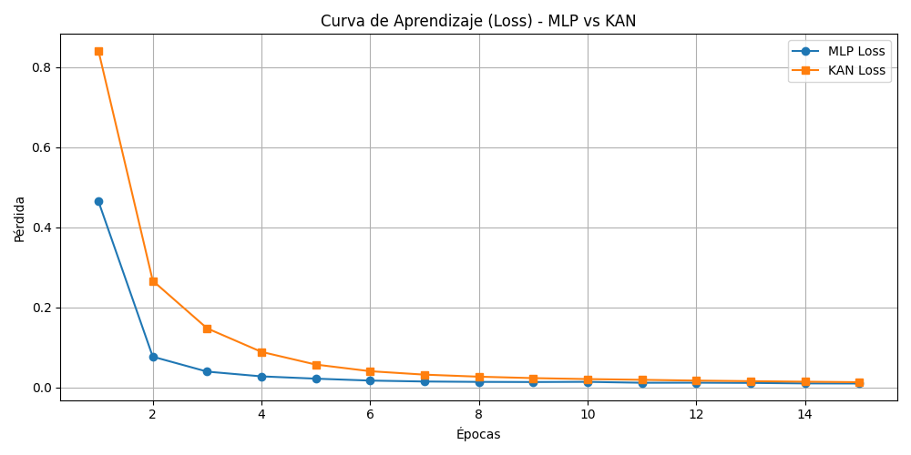
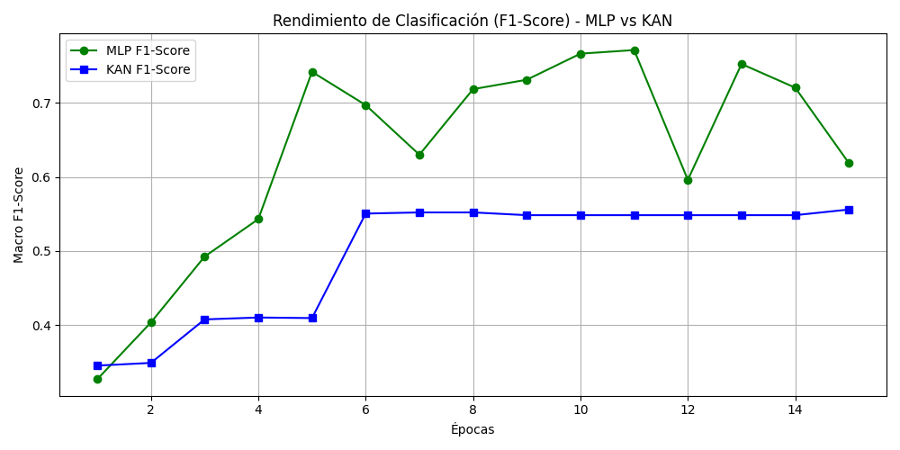
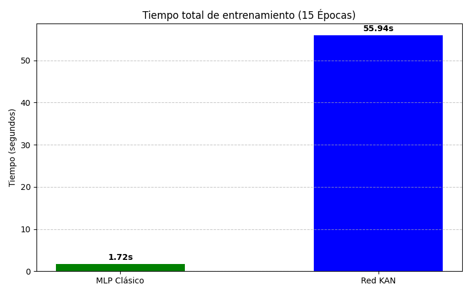

# 📊 Occupancy Estimation: KAN vs MLP


Este proyecto es un estudio comparativo entre la arquitectura tradicional de un Perceptrón Multicapa (MLP) y la reciente Red Kolmogorov-Arnold (KAN). El objetivo es predecir con precisión el número de ocupantes en una habitación (0, 1, 2, o 3 personas) basándose en una red de sensores ambientales de bajo costo ($CO_2$, temperatura, luz, sonido y movimiento).

Se están comparando:

1. **MLP Clásico:** Compuesta con dos capas ocultas (64 y 32 neuronas) y función de activación ReLU. Es el estándar actual de la industria, optimizado para cálculos matriciales rápidos.
2. **Red KAN:** Una arquitectura que reemplaza los pesos estáticos por funciones parametrizables (B-splines) en las conexiones (aristas). En este caso se eligió una única capa oculta de 8 nodos.


## 📈 Resultados (15 Épocas)

Las redes fueron entrenadas y evaluadas bajo las mismas condiciones. La métrica principal de éxito es el **Macro F1-Score**, dado el desbalance natural de las clases (la habitación suele estar vacía la mayor parte del tiempo).

| Métrica | MLP Clásico | Red KAN |
| :--- | :---: | :---: |
| **F1-Score (Test)** | **0.6188** | 0.5561 |
| **Exactitud (Accuracy)** | **95.41%** | 89.19% |
| **Tiempo de Entrenamiento** | **1.72 s** | 55.94 s |
| **Parámetros Entrenables** | 3,300 | **2,240** |

Durante el entrenamiento, las redes se comportaron de la siguiente manera:

#### 1. Curva de Aprendizaje (Pérdida)
Ambos modelos logran minimizar el error exitosamente. El detalle es que el descenso de la KAN es mucho más suave y constante, indicando que la KAN necesita un mayor número de épocas para moldear bien las funciones matematicas (comparado con la rapidez de los pesos del MLP)
<p align="center">
  
</p>

#### 2. Evolución del F1-Score
El MLP logra un rendimiento superior más rápido, pero tiene inestabilidad. Por otra parte, la red KAN presenta una curva más estable y predecible, aunque hace una meseta cerca de `0.55`. Esto es debido a que como son funciones más complejas, se evitan cambios bruscos de rendimiento, sacrificando velocidad de adaptación.
<p align="center">
  
</p>

#### 3. Costo Computacional
El intercambio principal de la arquitectura KAN: mayor precisión con menos parámetros, pero a un costo de tiempo de ejecución significativamente mayor.
<p align="center">
  
</p>

---

## 🛠️ Estructura del Proyecto

```text
occupancy-kan-vs-mlp/
├── data/                   # Dataset de sensores (CSV)
├── model/                  # Checkpoints generados por KAN
├── results/                # Gráficas generadas automáticamente
├── src/
│   ├── models/
│   │   ├── mlp_model.py
│   │   └── kan_model.py
│   ├── utils/
│   │   ├── data_loader.py
│   │   └── visualize.py
│   └── main.py
├── requirements.txt
└── README.md
```

## ⚙️ Instalación

Desde la raíz del proyecto:

```bash
python -m venv .venv
source .venv/bin/activate
pip install --extra-index-url https://download.pytorch.org/whl/cpu -r requirements.txt
```

## ▶️ Ejecución

Con el entorno virtual activado:

```bash
python src/main.py
```

Las gráficas se guardan automáticamente en `results/`.